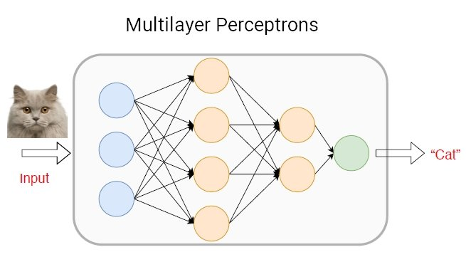

# <b>Explaining Backpropagation</b>

In this section, we're going to get into the details of the learning process of a multi-layer perceptron network, even though most of the focus is going to centered around the process of **backpropagation**. The content below is heavily inspired by a Stanford lecture back in 2018 titled [Leture 11 - Introduction to Neural Networks](https://youtu.be/MfIjxPh6Pys?list=PLoROMvodv4rMiGQp3WXShtMGgzqpfVfbU) and freely available on Youtube.

## Setup

Suppose we're building a neural network that's supposed to detect whether or not a picture is of a cat or not. We'll first determine the model that will make this detection. In simple terms, a **model** is the combination of the **architecture** and its **parameters**. Generally, an architeture is how neurons of a network are organised to work together. Do notice that, since we've already said we're a building a *multi-layer perceptron*, we've already specified the architecture. Therefore, what we're actually referring to - in this specific context - by "architecture", we're referring to the number of neurons in the architecture. 
Parameters on the other hand are values that determine how predictions are made, and therefore at the centre of the problem as we'll see.

Now the architecture that we're going to use in this specific case is as follows:

  

Looking at the image above, we'll have 4 layers:

* **One input layer** coloured in blue. It unrealistically has 3 features after the image has been flattened to a column vector of dimensions (1, 3). In reality, we should've had, for example, a $(64\times 64\times 64, 3)$ image as an input flattened to $(1, 12 288)$ column vector. So let's keep that at the back of our minds.
* **Two hidden layers** coloured in orange. The first layer will have 4 neurons and the second one will have 2.
* Finally we'll have **One output layer** coloured in green with only one neuron. Since we're dealing with a binary-classifcation problem, this neuron will be a binary variable, and we'll see how we'll use a sigmoid activation to achieve this.

However, in order to be consistent with the lecture, let's remove that hidden layer with 4 units so that we have the following architecture: 3 layers, each with 3, 2 and 1 units respectively.

<!-- ### The general training algorithm

* Initialise parameters
* Propagate the data through the network on a forward pass
* At the end of the network (after getting the prediction), compute the cost function
* Perform the backward pass to update the parameters based on the cost function -->

## Forward Propagation

Based on the architecture we've just described above, the forward pass equations will be as follows:  
$$
\begin{equation*}
  \begin{aligned}
    Z^{[1]} &= W^{[1]}A^{[0]} + b^{[1]},\text{ where } W^{[1]}\in\mathbb{R}^{3\times n}, A^{[0]}\in\mathbb{R}^{n\times 1} \implies b^{[1]}, Z^{[1]}\in\mathbb{R}^{3\times 1} \\
    A^{[1]} &= g^{[1]}(Z^{[2]})\in\mathbb{R}^{3\times 1}\text{ where } A^{[0]} = X, \text{ $n$ is the number of features in X}
  \end{aligned}
\end{equation*}
$$

$$
\begin{equation*}
  \begin{aligned}
    Z^{[2]} &= W^{[2]} A^{[1]} + b^{[2]},\text{ where } W^{[2]}\in\mathbb{R}^{2\times 3}, A^{[1]}\in\mathbb{R}^{3\times 1}\implies b^{[2]}, Z^{[2]}\in\mathbb{R}^{2\times 1} \\
    A^{[2]} &= g^{[2]}(Z^{[2]})\in\mathbb{R}^{2\times 1},
  \end{aligned}
\end{equation*}
$$

$$
\begin{equation*}
  \begin{aligned}
    Z^{[3]} &= W^{[3]} A^{[2]} + b^{[3]},\text{ where } W^{[3]}\in\mathbb{R}^{1\times 1}, A^{[2]}\in\mathbb{R}^{2\times 1}\implies b^{[3]}, Z^{[3]}\in\mathbb{R}^{1\times 1} \\
    A^{[3]} &= g^{[3]}(Z^{[3]})\in\mathbb{R}^{1\times 1},
  \end{aligned}
\end{equation*}
$$

In general, if you can carefully look at the pattern, you can do some simple analyses on the dimensions and notice that:
$$
\begin{equation*}
  \begin{aligned}
    Z^{[l]} &= W^{[l]} A^{[l-1]} + b^{[l]},\text{ where } W^{[l]}\in\mathbb{R}^{n_l\times n_{l-1}}, A^{[l-1]}\in\mathbb{R}^{n_{l-1}\times 1}\implies b^{[l]}, Z^{[l]}\in\mathbb{R}^{n_l\times 1} \\
    A^{[l]} &= g^{[l]}(Z^{[l]})\in\mathbb{R}^{n_l\times 1}\text{ where $n_l$ is the number of neurons/units in layer $l$}
  \end{aligned}
\end{equation*}
$$

In this case then, $W^{[l]}$ and $b^{[l]}$ are the parameters at layer $l$ while $g^{[l]}$ is the activation function. We give it a superscript $l$ because sometimes you may choose to have a different activation function for each layer.

### Batch Gradient-descent

One of the reasons why deep learning took off in the last decade or so, is due to improvements in computation. Since deep learning models are data-hungry, their adoption will also have to hinge on how fast the the machines we have can process that data. Now in recent years, our machines are able to parallelise computations, thus processing data at a much faster rate. To take advantage of this, the idea of **batch gradient-descent** took off, which is where, instead of passing through the network, one data point at a time, we pass a number of them simultaneously, so that they can be processed in parallel and their results can be aggregated to compute the loss and update the parameters. 
If you look at our input layer above, you'll notice that the idea of one training example per per pass is captured by the number 1 in $A^{[0]}=X\in\mathbb{R}^{n\times 1}$. In the era of parallelisation, we'll have $A^{[0]}=X\in\mathbb{R}^{n\times m}$ where $m$ is your batch size, or number of training examples that will collectively work together to make an update on the parameters.

**How does all this affect our propagation equations above??** 
I'm glad you asked. Show's you're paying attention (*as my professor would say :D*). We'll it's easy. We'll modify it as follows:
$$
\begin{equation*}
  \begin{aligned}
    Z^{[l]} &= W^{[l]} A^{[l-1]} + b^{[l]},\text{ where } W^{[l]}\in\mathbb{R}^{n_l\times n_{l-1}}, A^{[l-1]}\in\mathbb{R}^{n_{l-1}\times m}, b^{[l]}\in\mathbb{R}^{n_l\times 1}, Z^{[l]}\in\mathbb{R}^{n_l\times m} \\
    A^{[l]} &= g^{[l]}(Z^{[l]})\in\mathbb{R}^{n_l\times m}\text{ where $n_l$ is the number of neurons/units in layer $l$}
  \end{aligned}
\end{equation*}
$$

So we've replaced all the column dimension that had $1$ with $m$. It is at this point where you have to take a pause and think about why? It's not a very difficult idea though, its' simply because we've included more examples in each training batch.

If you indeed took the time to think about this, then one of things you should've also noticed that is that $b$ kept its dimensions, and therefore you should've asked yourself why. Well, this is because if you did modify its dimensions as well, you'll have added an unnecessary number of biases. If you did traditional machine learning with linear regression, you'll recall that the bias term was just there as an adjustment after all computations have been made. For example, in marketing, you can think of sales in the following function: $s(x) = mx + b$ where x is the marketing spent, m is the effect of that spending. In this case, $b$ can be interpreted as how much you would sell naturally before spending on marketing. 
>*Going back to our problem, the bias should therefore be an adjustment made after all *features* of $X$ have multiplied their respective *weights* (take a second to think about that as well). **It should therefore be a column vector based on the number of units in the current layer.***

I can hear you saying "*this is all great, unless it doesn't make mathematical sense; in Linear Algebra, we learn that vector addition is element-wise, so what do you mean it should be a column vector based on the number of units in the current layer?*" 
Again, I appreciate your attention and enthusiasm :D. You're right, this doesn't make sense, but since we still don't want to add an unnecessary number of parameters, we invented an operation called *broadcasting* in Python and the following is how I can generalise it's definition:

### Broadcasting in Python

If you have a matrix $A\in\mathbb{R}^{m\times n},$ and $B\in\mathbb{R}^{1\times n}$ or $B\in\mathbb{R}^{m\times 1}$, broadcasting can still allow you to perform any type of arithmetic $A*B$ (**except** matrix multiplication `@`). In the first instance, it copies $B, m$ times vertically to form $C\in\mathbb{R}^{m\times n} \text{ s.t:}$

$$
A*B=C\text{ where }B, C\in\mathbb{R}^{m\times n}
$$

Similarly, $B$ will be repeated $n$ times horizontally to achieve the same result in the second case.

Now, this is not something that’s supposed to happen mathematically, so the fact that it does, then you have to be very careful that you may have bugs in your code that are difficult to spot because now an operation that was NOT supposed to happen has happened anyway. It’s nonetheless a useful feature.

**Tip**: It would help to avoid using rank one vectors i.e. those with a shape `(m, )` . Ensure that it’s an `(m, 1)` dimensional vector because in this form, they behave in a predictable/expected way. It could also be useful to use assertion statements on the dimensions of your vectors to ensure that they’ll behave as expected. If your code has created a rank one array, then you can use the `reshape()` function in numpy e.g. `a=a.reshape((5,1))` where $a$ was of dimensions `(5, )`.

## Optimizing weights & biases

At this point, I think we have covered all that needs to happen in the forward pass, meaning our computationns are now at the end of the neural network. Our next step is to thus work toward optimising our parameters through a clever procedure of updating them. This procedure requires defining an objective function, a way to determine how good or bad our current parameters are performing, so that we can adjust them accordingly i.e. if they did well, then don't adjust them (*you don't want to change what works*). On the other hand, if they made a bad prediction, then you need to nudge them in the right direction. We're going to do this process over and over, until our parameters are good enough. this is the actual process of training.

**Loss/Cost/Objective function** 
Since we're doing a supervised learning problem, our training examples come with their respective outcomes.

Now, you may have heard that machine learning in general is a combination of statistics, mathematics and computer science and so far we've seen mathematics through linear algebra, and calculus as we'll see shortly. We've also seen computer science since all of this needs to be written in a programming language, meaning we have to understand computer things like `numpy` performing broadcasting. What about statistics?? Maybe this is your chance to shine if you were a statistics major. I was a double major in mathematics and computer science so I'll probably not dive too deep into statistics as you'll see in the following explanation.

So in statistics (maybe even in information theory), there's this idea of **maximum likelihood estimation** (MLE) for logistic regression, which is used for binary classification tasks. Through it, we can derive what we call a ***cross-entropy loss*** or the ***logistic loss*** function which can be computed as follows:
$$
  \begin{equation*}
    \begin{aligned}
      L^{(i)}(\hat y, y) &= -[y^{(i)}\log(\hat y^{(i)})+(1-y^{(i)})\log(1-\hat y^{(i)})]
    \end{aligned}
  \end{equation*}
$$
This loss function quantifies the difference between the predicted probabilities $\hat y$ and the true binary labels $y$, aiming to minimize this discrepancy during model training. Its formulation is closely tied to the logistic function (sigmoid function) and the concept of entropy in information theory.

So in deep learning we use it to define the objective/cost function for binary classification as follows:
$$
  \begin{equation*}
    \begin{aligned}
      J(\hat y, y) &= \frac{1}{m}\sum^m_{i=1}L^{(i)}(\hat y, y)
    \end{aligned}
  \end{equation*}
$$
where $J$ is the cost function over all $m$ training examples in the batch. The values of $W$ and $b$ that we're most interested in are those that minimise the cost function $J$. **Analytically**, we could easily do this by solving the equations $\frac{\partial J}{\partial W^{[l]}} = \mathbb{O}$ and $\frac{\partial J}{\partial b^{[l]}} = \mathbb{O}$. But good God that's gonna be a nightmare to do since we're dealing with quite a number of parameters in deep learning (high-dimensionality). Also, not only will you have a really huge number of equations, but they'll be non-linear due to activations in the network which just makes it impossible to get a closed-form exact solution. This is why the community has been using the **numerical approach** called gradient descent, specifically, stochastic gradient descent to approximate the values minimising the cost function.

The intuition behind gradient descent is that you just start at some random point on the cost function i.e. random values of $W$ and $b$ and then use the gradient of the graph to help us decide on which direction to go i.e. how to update the parameters. We do this over and over until we feel like we're close enough to conversion. Therefore, we update the parameters like this:
$$
\begin{equation*}
  \begin{aligned}
    W^{[l]} &\gets W^{[l]} - \alpha \frac{\partial J}{\partial W^{[l]}} \\
  b^{[l]} &\gets b^{[l]} - \alpha \frac{\partial J}{\partial b^{[l]}}
  \end{aligned}
\end{equation*}
$$
where $\alpha$ is the learning rate.

### Backpropagation

Now, numerically finding the values of $\frac{\partial J}{\partial W^{[l]}}$ and $\frac{\partial J}{\partial b^{[l]}}$ will then need us to use the **chain rule** of derivatives because if you look at our functions above, they're composite. The word **backpropagation** comes from the fact that you can't compute $\frac{\partial J}{\partial W^{[1]}}$ before computing $\frac{\partial J}{\partial W^{[2]}}$, you need to start at the end of the network, then work your way back to the beginning where you'll be able to have the value of $\frac{\partial J}{\partial W^{[l]}}$ and finally a way to make your parameter updates.

**So does this happen?** 
Starting with a derivative with respect to $W^{[3]}$, we first notice that it's dependent on $Z^{[3]}$ which is itself dependent on $A^{[2]}$. Roll your sleeves 'cause it's gonna be a ride:
$$
\begin{equation*}
  \begin{aligned}
    \frac{\partial J}{\partial W^{[3]}} &= \frac{1}{m}\sum^m_{i=1}\frac{\partial L}{\partial W^{[3]}}
    = \frac{\partial L}{\partial A^{[3]}}\cdot\frac{\partial A^{[3]}}{\partial Z^{[3]}}\cdot\frac{\partial Z^{[3]}}{\partial W^{[3]}} \\
  \end{aligned}
\end{equation*}
$$

$$
\begin{equation*}
  \begin{aligned}
    \frac{\partial Z^{[3]}}{\partial W^{[3]}} &= A^{[2]}\in\mathbb{R}^{2\times 1} \\ % important result
    \frac{\partial A^{[3]}}{\partial Z^{[3]}} &= g^{[3]'}(Z^{[3]}) 
      = g^{[3]}(Z^{[3]})[1-g^{[4]}(Z^{[3]})] \\
      &= A^{[3]}(1-A^{[3]})\in\mathbb{R}^{1\times 1} \\ % important result
    \frac{\partial L}{\partial A^{[3]}} &= -\frac{\partial}{\partial A^{[3]}}[y^{(i)}\log(A^{[3]})+(1-y^{(i)})\log(1-A^{[3]})] \\
      &= -\left[\frac{y^{(i)}}{A^{[3]}} + \frac{1 - y^{(i)}}{1 - A^{[3]}}\right] \\
      &= -\left[\frac{y^{(i)}(1 - A^{[3]})-A^{[3]}(1-y^{(i)})}{A^{[3]}(1-A^{[3]})}\right] \\
      &= \frac{y^{(i)}-A^{[3]}}{A^{[3]}(1-A^{[3]})}\in\mathbb{R}^{1\times 1} \\ % important result
  \end{aligned}
\end{equation*}
$$

Therefore,
$$
\begin{equation*}
  \begin{aligned}
    \frac{\partial J}{\partial W^{[3]}} &= -\frac{1}{m}\sum^m_{i=1}\frac{\partial L}{\partial W^{[3]}}
    = \frac{1}{m}\sum^m_{i=1}\frac{y^{(i)}-A^{[3]}}{A^{[3]}(1-A^{[3]})}\cdot A^{[3]}(1-A^{[3]})\cdot A^{[2]} \\
    &= \frac{1}{m}\sum^m_{i=1}[y^{(i)}-A^{[3]}]\cdot A^{[2]}\text{ where the dimension are (1, 1) and (2, 1) respectively} \\
    &= \frac{1}{m}\sum^m_{i=1}\left(y^{(i)}-A^{[3]}\right)\left(A^{[2]}\right)^T\in\mathbb{R}^{1\times 2}
  \end{aligned}
\end{equation*}
$$

At this point we can now update $W^{[3]}$. After that, we'll still need to compute $\frac{\partial J}{\partial W^{[2]}}$ and $\frac{\partial J}{\partial W^{[1]}}$ which I'm a little lazy to do. But let's try $\frac{\partial J}{\partial W^{[2]}}$ because it seems possible my mere inspetion. If we do this inspection without think about what I want to call the "critical path", then you may run into something like:
$$
  \begin{equation*}
    \begin{aligned}
       \frac{\partial J}{\partial W^{[2]}} = \frac{1}{m}\sum^m_{i=1}\frac{\partial L}{\partial W^{[2]}}
      = \frac{\partial L}{\partial A^{[2]}}\cdot\frac{\partial A^{[2]}}{\partial Z^{[2]}}\cdot\frac{\partial Z^{[2]}}{\partial W^{[2]}}
    \end{aligned}
  \end{equation*}
$$
which looks fine, looks quite similar to what we did before. However, it shouldn't take you long to realise this won't work, and a glaring problem is that first step where you're going to look for the derivative of $L$ with respect to $W^{[2]}$ which will just cause you unnecessary headache. A reasonable path would be:
$$
  \begin{equation*}
    \begin{aligned}
       \frac{\partial J}{\partial W^{[2]}} = \frac{1}{m}\sum^m_{i=1}\frac{\partial L}{\partial W^{[2]}}
      = \frac{\partial L}{\partial A^{[3]}}\cdot\frac{\partial A^{[3]}}{\partial Z^{[3]}}\cdot\frac{\partial Z^{[3]}}{\partial A^{[2]}}\cdot\frac{\partial A^{[2]}}{\partial Z^{[2]}}\cdot\frac{\partial Z^{[2]}}{\partial W^{[2]}}
    \end{aligned}
  \end{equation*}
$$

We have already seen that:
$$
\begin{equation*}
  \begin{aligned}
    \frac{\partial L}{\partial A^{[3]}}\cdot\frac{\partial A^{[3]}}{\partial Z^{[3]}} &= y^{(i)}-A^{[3]}\in\mathbb{R}^{1\times 1} \\
    \frac{\partial Z^{[3]}}{\partial A^{[2]}} &= W^{[3]}\in\mathbb{R}^{1\times 2} \\
    \frac{\partial A^{[2]}}{\partial Z^{[2]}} &= g^{[2]'}(Z^{[2]}) = g^{[2]}(Z^{[2]})(1-g^{[2]}(Z^{[2]})) \\
    &= A^{[2]}(1-A^{[2]})\in\mathbb{R}^{2\times 1} \\
    \frac{\partial Z^{[2]}}{\partial W^{[2]}} &= A^{[1]}\in\mathbb{R}^{3\times 1}
  \end{aligned}
\end{equation*}
$$

Now, putting it altogether, while also being mindful of mismatched shapes, we can conclude that:
$$
\begin{equation*}
  \begin{aligned}
    \frac{\partial J}{\partial W^{[2]}} = \frac{1}{m}\sum^m_{i=1}\frac{\partial L}{\partial W^{[2]}}
    &= \left(y^{(i)} - A^{[3]}\right)W^{[3]}A^{[2]}(1-A^{[2]})A^{[1]} \\
    &= W^{[3]T}A^{[2]}(1-A^{[2]})(y^{(i)} - A^{[3]})A^{[1]T}
  \end{aligned}
\end{equation*}
$$

The shapes of the terms above don't match correctly, so in our attempt to make them compatible, we also have remember that $\frac{\partial J}{\partial W^{[2]}}\in\mathbb{R}^{2\times 3}$ because of the dimensions of $W^{[2]}$, so it's much more convenient to do element-wise multiplication of $W^{[3]T}(A^{[2]}(1-A^{[2]}))^T$, this way we'll have the following dimensions: $(2, 1) (2, 1) (1, 1) (1, 3) = (2, 3)$.
